# 3 Aula consumo de APIs

Deve-se criar uma pasta services para separar a responsabilidade dela
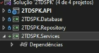
e dentro dela cria uma pasta cep para consumo da nossa pi de cep dentro do services
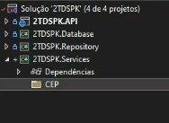
dentro dela crai uma classe que vamos chamar de AddressResponse onde vamos guardar a API
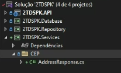
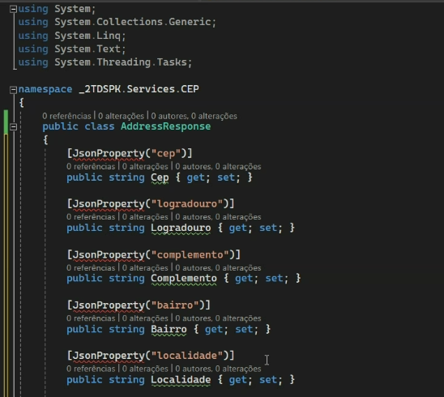
voce também vai precisar instalar um pacote chamado newtonsoft.json
também é uma boa pratica quando temos um servico nos criarmos uma interface
entao criamos uma interface chamada ICEPService
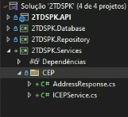
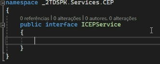
eu vou precisar de um metodo que retorne uma address response chamado GetAddressbyCEP(string CEP)
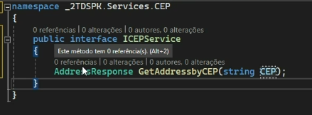
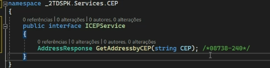
agora precisamos de adicionar uma implementação desse servico chamado CEPService qeu implementa a interface ICEPService
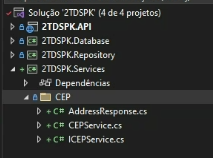
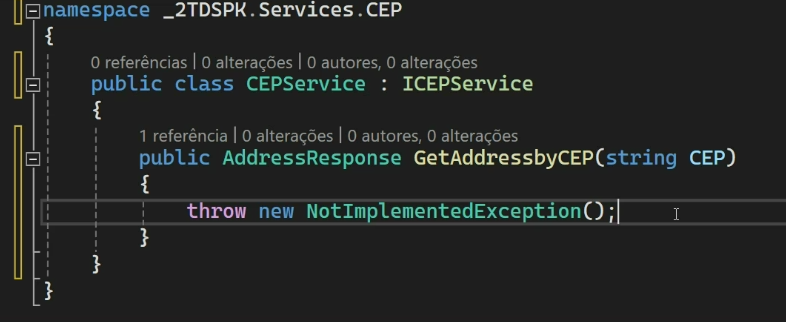
agora implementamos a comunicação com o viacep
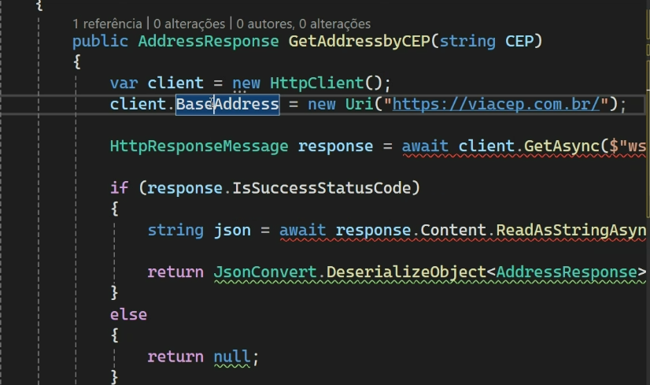
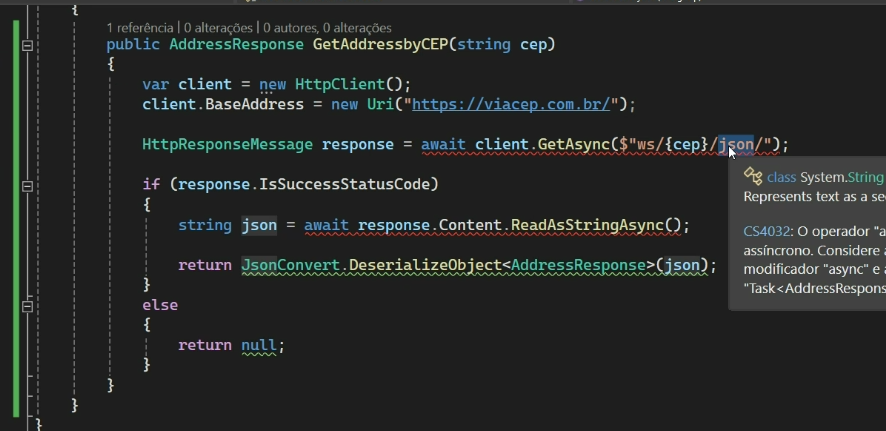
sincrono e assincrono:
 - quando algo é sincrono ele ocorre de uma forma sequencial exemplo voce pede varios cafes e ele vai fazendo um por vez e enquanto ta fazendo um ele bloquea o proximo ate que seja terminado o que ele ta fazendo, é uma rotina sequencial e bloqueante, ela bloqueia o fluxo
 caracteristicas: bloqueio  o fluxo é interrompido enquanto o ultimo nao ficou pronto
 - já o assincrono permite a gente fazer alguma coisa enquanto outras coisas sao executadas, exemplo em uma cafeteria enquanto um café esta sendo feito ele ja faz o outro café de outra pessoa, ao mesmo tempo, caracteristica: nao bloqueante e ele gera uma promise
tem que transformar o metodo em assincrono para funcionar
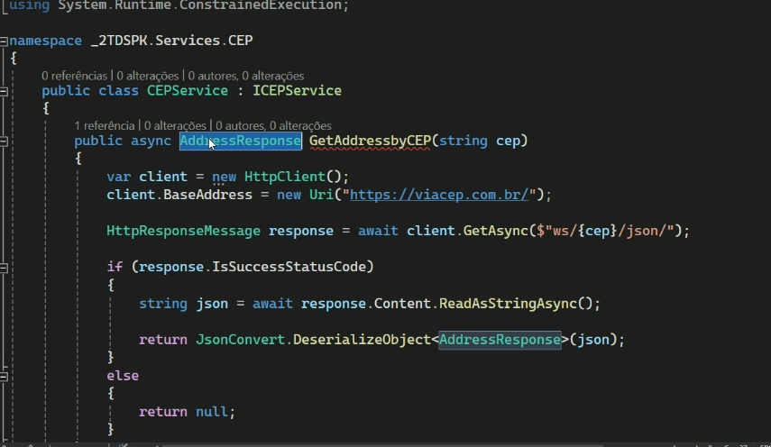
tem que transformar o ICEPService em assincrono tambem dizendo que eu terei uma tarefa assincrona
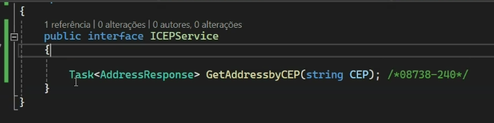
tambem preciso dizer que ele vai ser uma tarefa assincrona
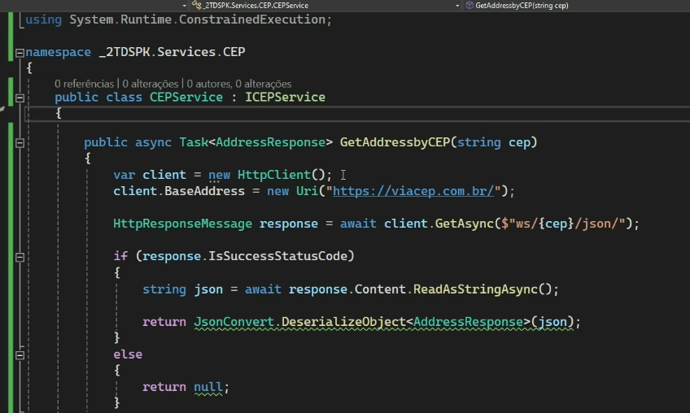
o ICEPService ele vai entao pegar os dados pelo CEP e jogar pro CepService
agora vamos criar um novo endpoint para testar o cep
adicionamos um novo CEPController
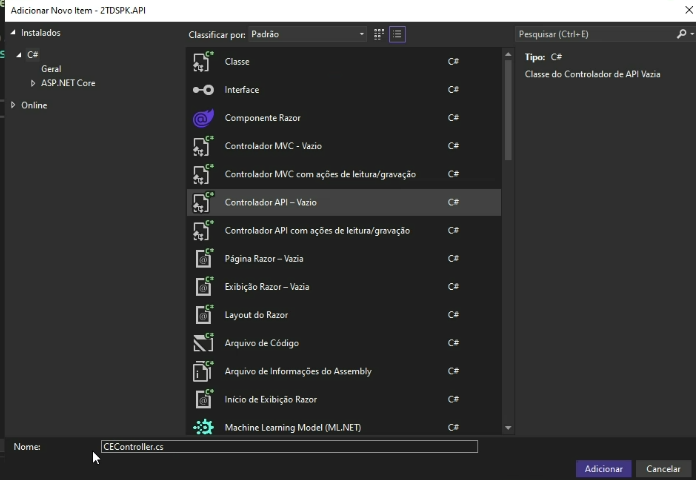
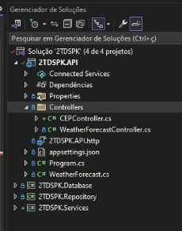
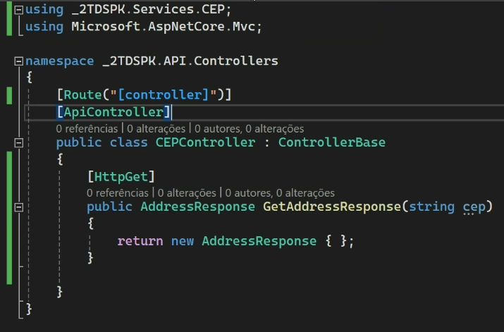
para isso precisamos fazer a injeção de dependência
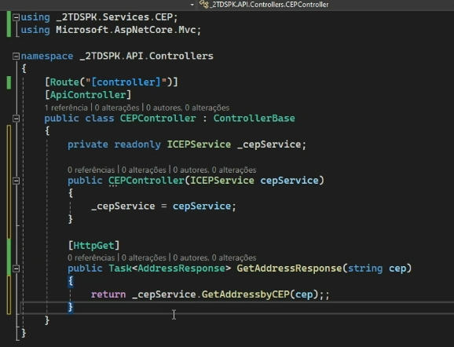
a injeção de dependência serve para
tambem é boa pratica documentar as respostas de api
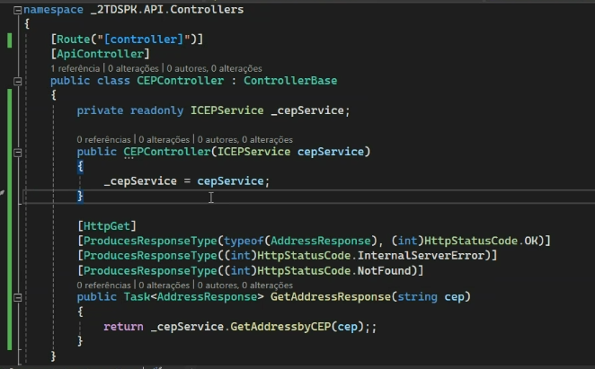
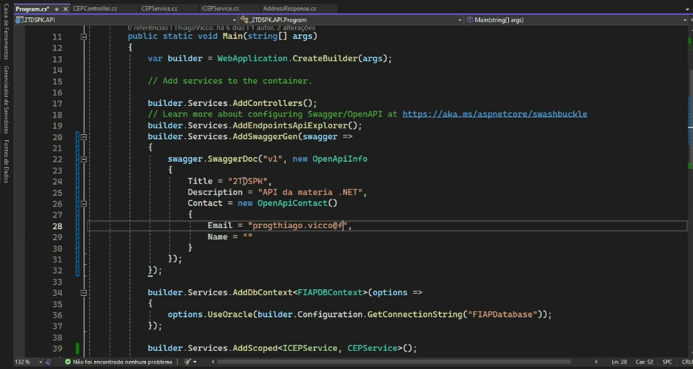
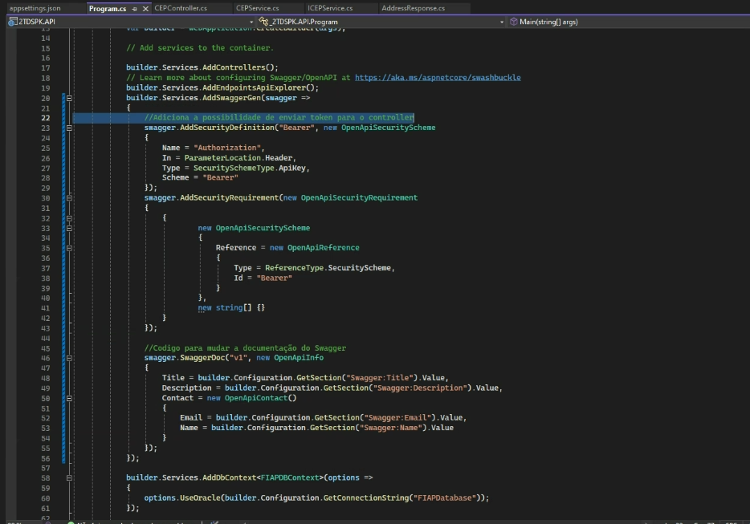
extensao de metodo: proxima aula