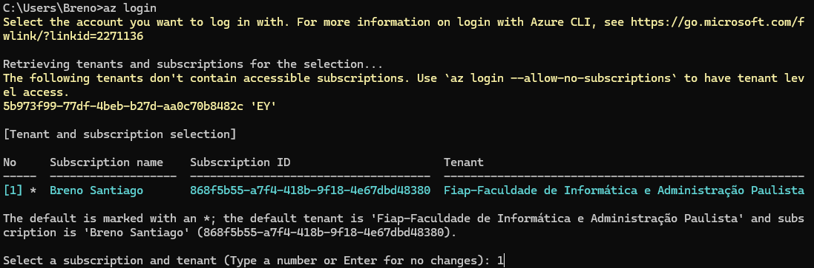
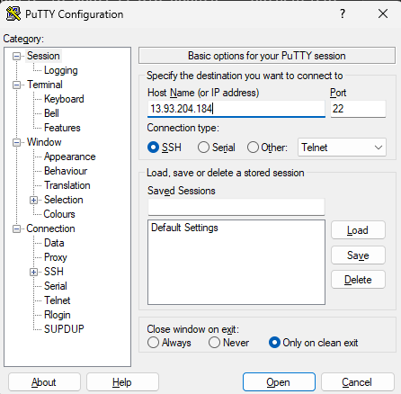
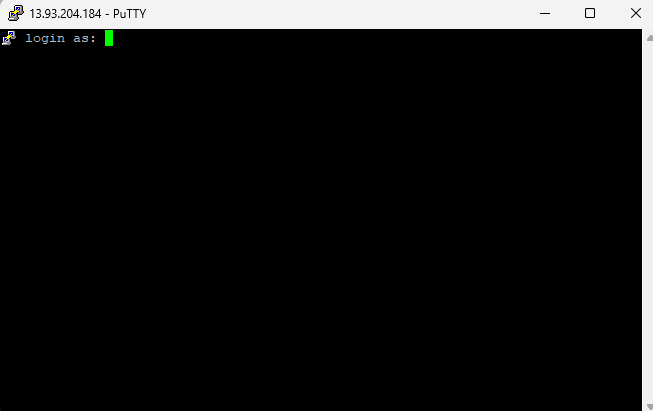

# Aula de revisão para CP1

Ver versão instalada
```
az --version
```

Ver versão instalada
```
az --version
```

Link para instalar o azure CLI se não tiver instalado
```
https://learn.microsoft.com/pt-br/cli/azure/install-azure-cli-windows?tabs=azure-cli
```

Fazer login
```
az login
```


Buscar todos os itens
```
az find "az webapp"
```

Ver todos os grupos que tem na conta
```
az group list
```

Criar um grupo
```
az group create --name group_teste --location brazilsouth
```

Deletar um grupo
```
az group delete --name group_teste
```

Lista toda as assinaturas que você tem acesso
```
az account list
```

Cria um txt com a lista de todas as localizações
```
az account list-locations --output table > datacenters.txt
```

Lista se tem máquinas virtuais dentro da conta
```
az vm image list --all
```

**Criando uma máquina virtual**
- Cria um grupo de recursos
```
az group create --name rg-vmubuntu --location brazilsouth
```
- Cria uma vm dentro desse grupo de recursos
```
az vm create --resource-group rg-vmubuntu  --name vm-ubuntu  --image Canonical:UbuntuServer:19_04-gen2:19.04.201908230 --size Standard_B2s --vnet-name nnet-Linux --nsg nsgsr-linux --public-ip-address pip-ubuntu  --authentication-type password  --admin-username admlnx --admin-password Fiap@2tdsvms
```

**Testando no PuTTY:**
- Coloque o ip da máquina no PuTTY e depois clique en open:

- Depois basta logar com usuário e senha criados



Deletando NetworgWatcherRG
```
az group delete --name NetworkWatcherRG -y
```