# Aula 1 - Introdução ao React Native

## JavaScript
- Linguagem interpretada
- Tipagem dinamica fraca (quando declaramos uma variavel ela nao tem tipo)
- Multi-paradigma (não possui um tipo fixo de paradigma para programação: orientação a objetos, orientação a eventos...)
- Inicialmente projetada para Web
- Pode ser usada como Client-Side ou Server-Side
- Uma das linguagens mais utilizadas
- Criada em 1995 por Prendan Eich (Netscape)
- Possui nome JavaScript como forma de aproveitar a fama da linguagem Java na época de seu lançamento
- No Internet Explorer 3, iniciou-se uma implementação modificada chamada JScript
- Passou a ser uma linguagem padronizada em 1997 pela European Computer Manufactures Association
- Syntax semelhante com outras linguagens baseadas em C (mais ou menos)
- Nome oficial: ECMAScript
- Usada no desenvolvimento WEB - (Client-side)
- Usada no desenvolvimento WEB - (Server-side / Node.JS)
- Usada no desenvolvimento Desktop (Electron)
- Usada no desenvolvimento Mobile (Cordova, Ionic, React Native)
- Permite programação assíncrona
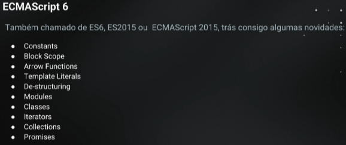

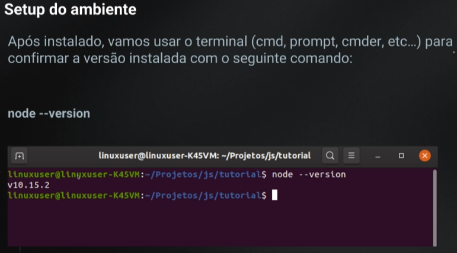
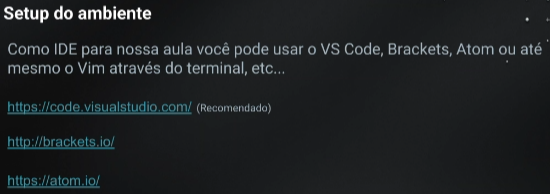

## Primeiro projeto
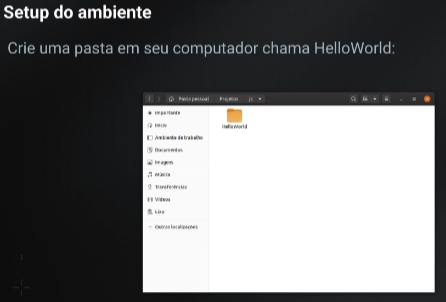
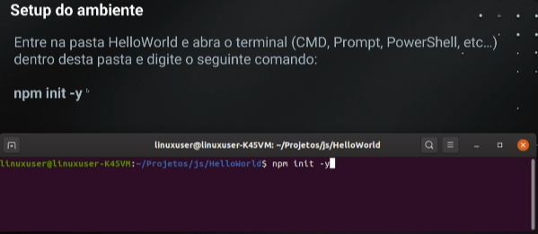
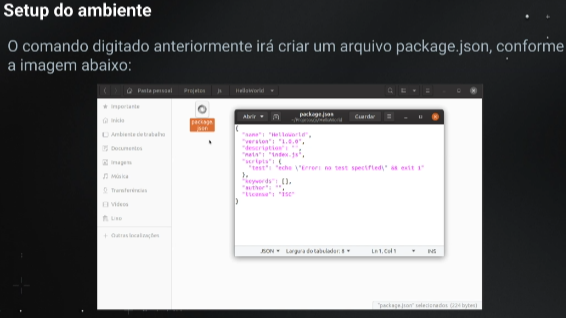
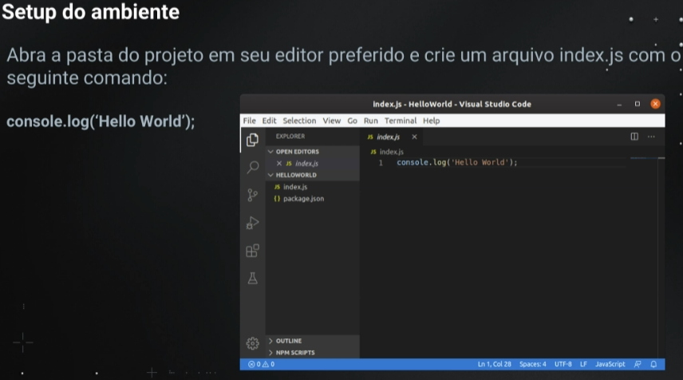

## Babel
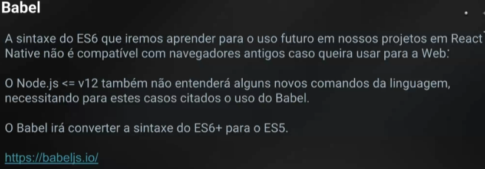
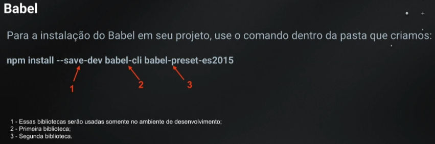
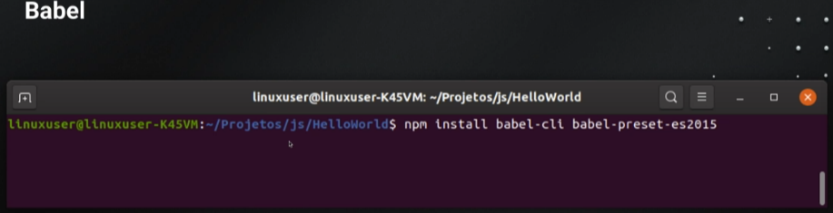
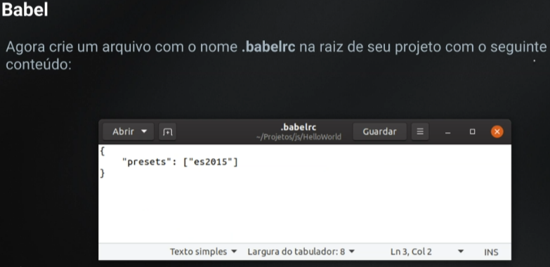
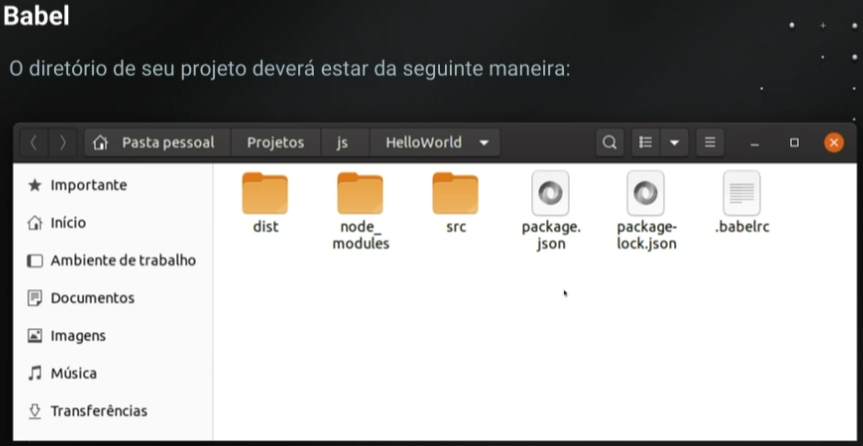
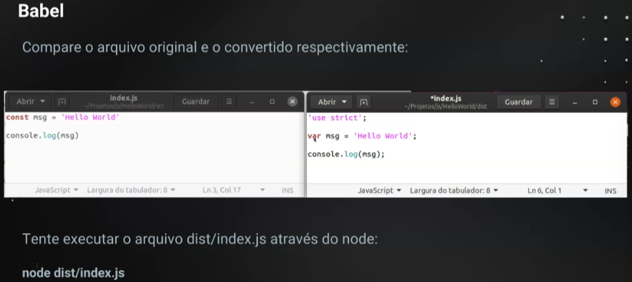

## Syntax
### Modificadores de variável
- const: constante, não pode ser mudado uma vez que declarado, diferente do let e var
- let: permite mudar a variável
- var: legado, nao mais utilizado
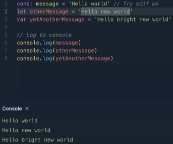

### Funções
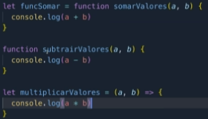