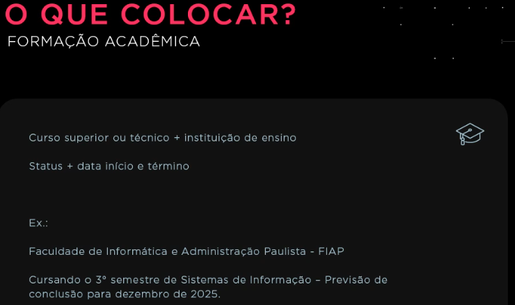
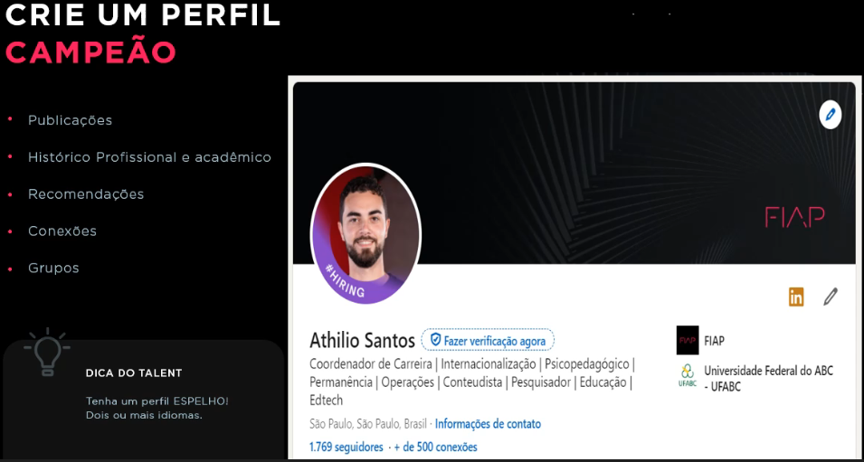

# Dicas
 - Construir perfil no linkedin em outras línguas
 - Adicionar hashtags
 - Editar o seu currículo de acordo com a vaga (currículo não é estático)
 - Priorizar sempre os certificados e cursos relevantes para aquela vaga

# Currículo

## O que colocoar

# Linkedin
## Perfil Campeão

## Conete-se com pessoas que você conhece e admira

## Encontre a sua oportunidade

